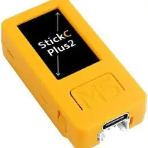
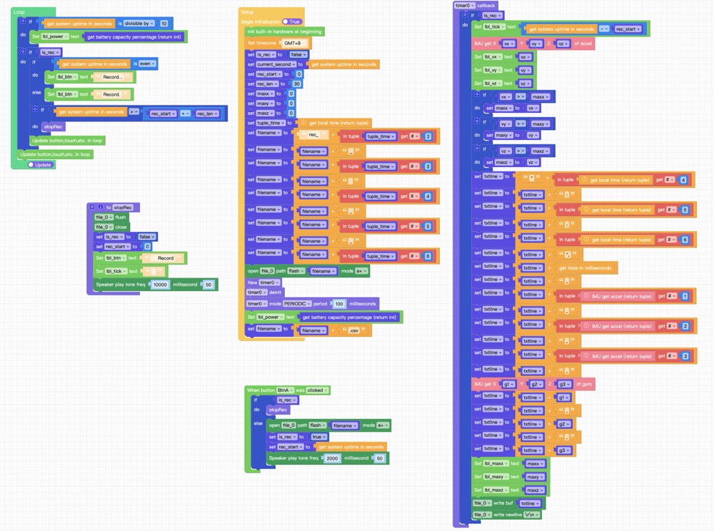

# M5 Stack Programe

As a hardware part of this runmeter project, the code of this part is burned in a smart device which is a small smart module called M5StickC Plus 2.

## Device
M5StickC Plus 2

## Program

Visited the url following,  and you can program your device using Drag & Drop some toys like on Scratch.

[UI Flow](https://uiflow2.m5stack.com)

I shared my hardware project on Project Zone.

### Project Zone
ID: 142448
Name: run meter

### Graph

### Python
[MicroPython Code (Export from Graph)](./micropython.py)

